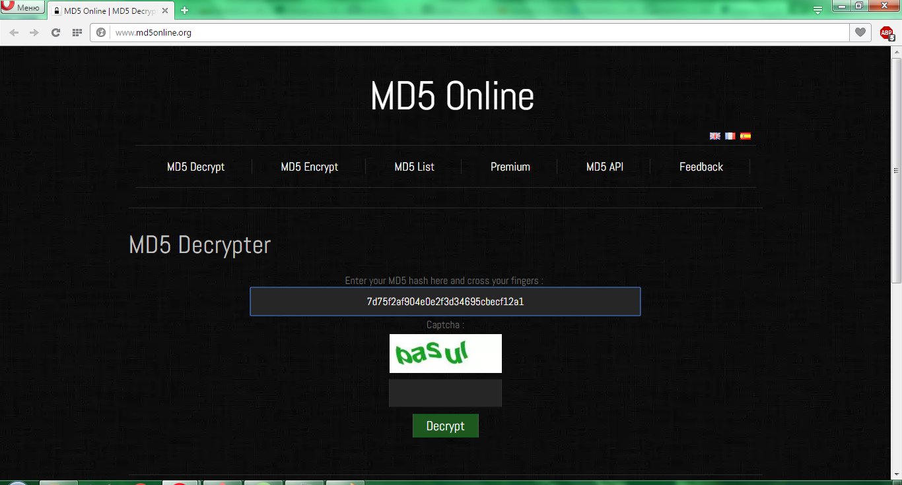
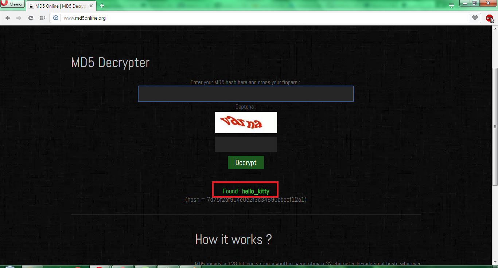

# UFO CTF School 2016 : hashionable task

**Category:** crypto **Points:** 25
**Author:** lsds 

**Description:**

> *RU*: Посмотрим, насколько хорошо ты знаешь криптографию  
> *ENG*: Let's see how well you are familiar with cryptography

## Write_up

Находим сайт, который раскодирует сообщение  

Декодируем сообщение, получаем флаг  

## Flag

> **flag{hello_kitty}**
