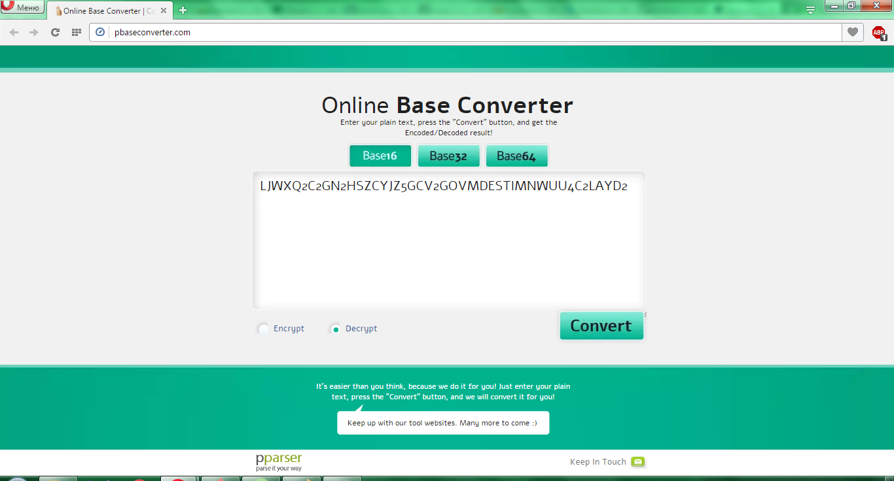
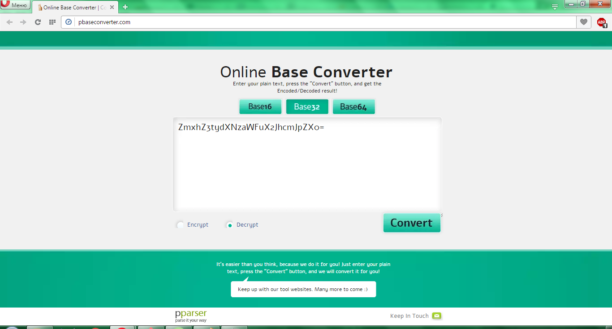
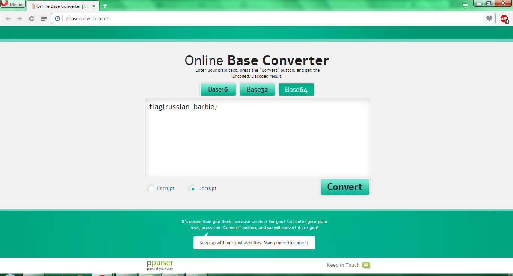

# UFO CTF School 2016 : on1ON

**Category:** crypto **Points:** 50
**Author:** lsds 

**Description:**

> *RU*: Похоже, создатель этого зашифрованного сообщения увлекается русской народной культурой  
> *ENG*: It looks like creator of this encrypted message is keen on Russian folk culture

## Write_up

Находим онлайн-декодер  

Декодируем данное нам сообщение в base 16 и получаем новую строку:
> LJWXQ2C2GN2HSZCYJZ5GCV2GOVMDESTIMNWUU4C2LAYD2

Декодируем эту строку в base 32 и получаем:
> ZmxhZ3tydXNzaWFuX2JhcmJpZX0=

Полученную строку декодим в base 64 и на выходе получаем флаг

## Flag

> **flag{russian_barbie}**
