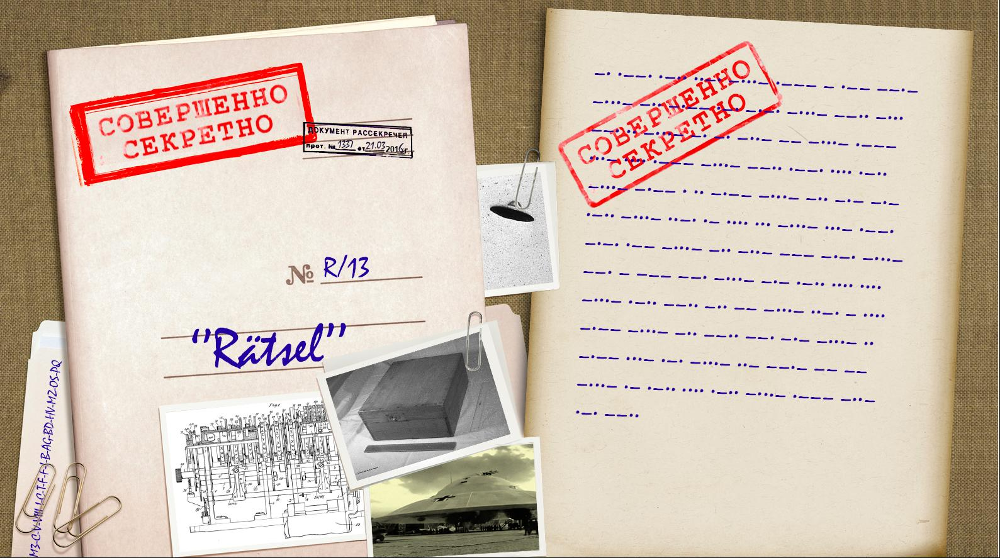

# UFO CTF School 2016 : Ratsel

**Category:** crypto **Points:** 200
**Author:** innhunter 

**Description:**

> RU: Странная вещица, но мне она не зачем, можешь забрать.  
> ENG: The strange document, but I do not need it, take.

## Write_up

Скачиваем изображение. Видим, что некоторый текст зашифрован с помощью азбуки Морзе. Декодируем получив набор символов:

Морзе:

> –· ·––· ·–·· ··–· –···– ·––– – ·–– ––·– –···– –·· –·–– ·–· –·–· –···– ––·· –··· ––· ·· –···– –· –· –··– –– –···– ·––– ···– ···· ·––– –···– ––·· ·––· ···· ·–·· –···– –·–– · ·· –·–– –···– –·· –·– –·– ·–·· –···– ··–· ·– ···· ··· –···– ···– ·––· –·–· ·–– –···– –·· –··– ––– –·–· –···– ––· – ––– ––· –···– –·– ·–·· ···· ···· –···– ·–·· ––·· –·· –– –···– ··–· – ···· –·–– –···– –·· ––·· ––· –·– –···– ·· –·–– ···– ·–· –···– ··– ––·– –– –– –···– ·– ·–·· ···· ·–·· –···– ·––– –··– ·–· ––··

Расшифровываем морзе-код:  
> NPLF JTWQ DYRC ZBGI NNXM JVHJ ZPHL YEIY DKKL FAHS VPCW DXOC GTOG KLHH LZDM FTHY DZGK IYVR UQMM ALHL JXRZ

Далее замечаем картинку-ключ. Получаем набор символов ключа:  
> M3-C-V-VIII-I-C-T-F-F-I-B-AG-BD-HV-MZ-OS-PQ

Далее решение задачи не представляет труда, если вы хоть немного знакомы с криптологией Второй Мировой войны, а именно шифровальной машиной ENIGMA. Основная сложность заключается в поиске подходящего декодера.
Я использовал http://enigma.louisedade.co.uk/enigma.html

Задаем основные параметры машины, согласно ключу.
* Модель: M3
* Рефлектор: С
* Роторы: V-VIII-I
* Кольца: C-T-F
* Начальные позиция: F-I-B
* Коммутационная панель: AG-BD-HV-MZ-OS-PQ

После дешифрования получаем строку:  
> WHFG OBZO RNAQ OEVG VFUP ELCG BYBT VFGF PNAQ RPVC URET REZN ARAV TZNZ NPUV ARGU RSYN TVFL BHYV XRNO BZOR

Сдвигаем полученае сообщение по ROT13 и расставляем пробелы в нужных местах:

> Just bombe and British cryptologists can decipher German Enigma-machine. The flag is you like a bombe.

Смотрим на хинт, который описывает формат флага:
Формат флага *flag{text_text_text_text}*

## Flag

> **flag{you_like_a_bombe}**
