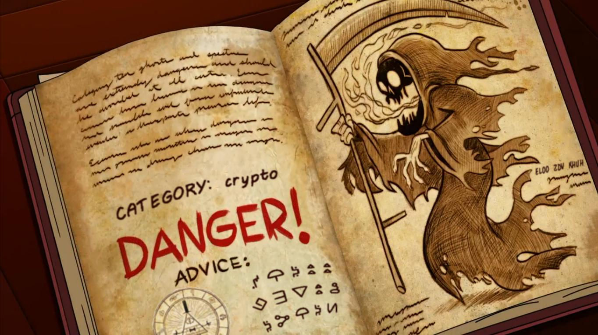
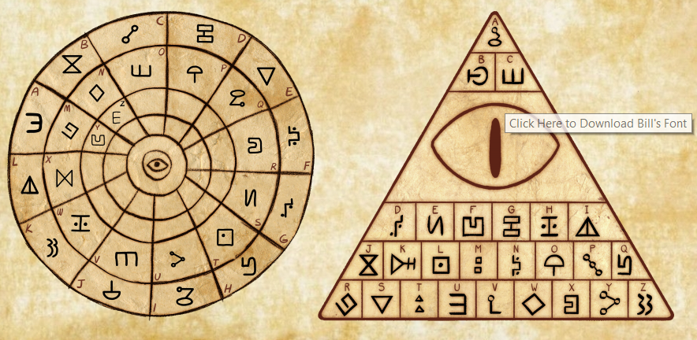

# UFO CTF School 2016 : triangulum

**Category:** crypto **Points:** 100
**Author:** innhunter 

**Description:**

> RU: Помни! Реальность — иллюзия, вселенная — голограмма, скупай золото, пока!  
> ENG: Remember! Reality is an illusion, the universe is a hologram, buy gold, bye!

## Write_up

В самом таске достаточно подсказок для его решения.  

Пользуемся GOOGLE'ом, находим, что шифр на картинке связан с мультсериалом Gravity Falls.  
Переходим на сайт сериала (http://themysteryofgravityfalls.com) и получаем две таблицы для декодирования(по мульту - шифр создателя и шифр Билла).  
Далее можно самостоятельно определить нужную таблицу, а можно воспользоваться маленькой подсказкой в правой части картики.  
**ELDO ZDV KHUH - Caesar Cipher(3) - BILL WAS HERE** - пользуемся таблицей Билла.

## Flag

> **flag{DONTTRUSTANYONE}**
