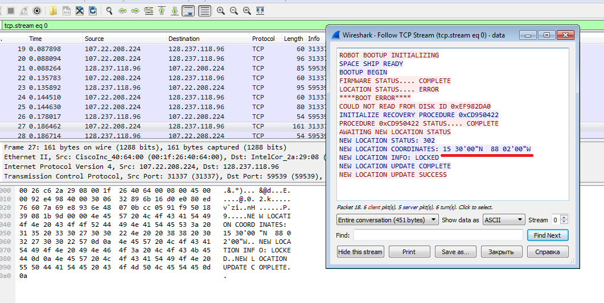
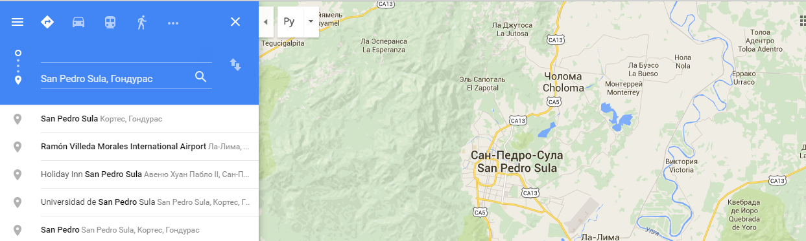

# UFO CTF School 2016 : coordinates

**Category:** forensics **Points:** 100
**Author:** richard 

**Description:**

> В перехваченном файле есть информация о каком-то объекте. Точно не известно, что это.

## Write_up

В файле просматривает пакеты с наибольших объемом. Встречаем строчку:

* NEW LOCATION STATUS: 302 
* NEW LOCATION COORDINATES: 15 30'00"N 88 02'00"W 
* NEW LOCATION INFO: LOCKED 
* NEW LOCATION UPDATE COMPLETE

Нашли координаты и по ним определяем объект с помощью google maps. Это город San Pedro Sula

## Flag

> **flag{San\_Pedro\_Sula}**
