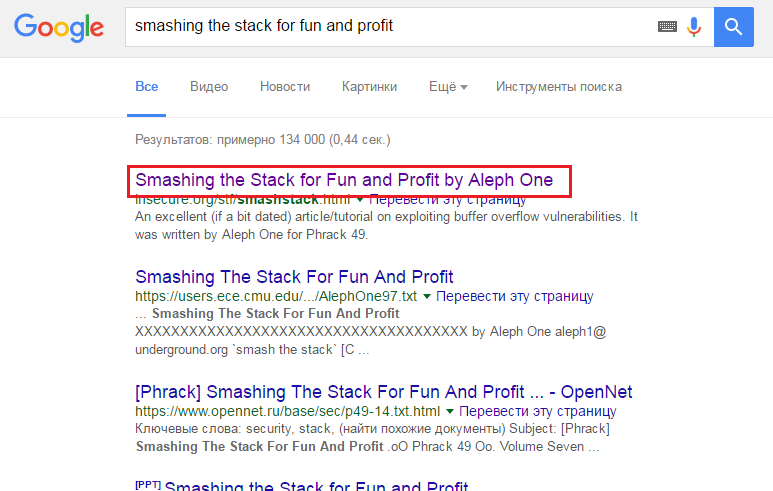

# UFO CTF School 2016 : searchforsomething

**Category:** forensics **Points:** 100
**Author:** richard 

**Description:**

> Проанализируйте файл и найдите, что искали

## Write_up

При просмотре пакетов, замечаем следующий запрос:
```
GET /search?q=smashing+the+stack+for+fun+and+profit&form=MOZSBR&pc=MOZI HTTP/1.1
```
Если загуглить *smashing the stack for fun and profit*, то получим следующие:

*Smashing the Stack for Fun and Profit by Aleph One*

## Flag

> **flag{Aleph_One}**
