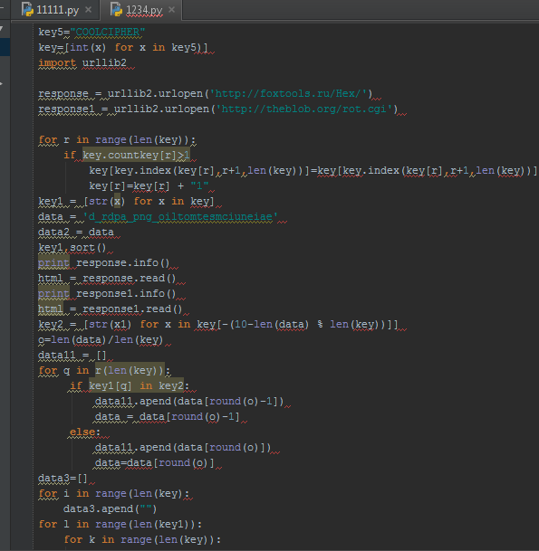
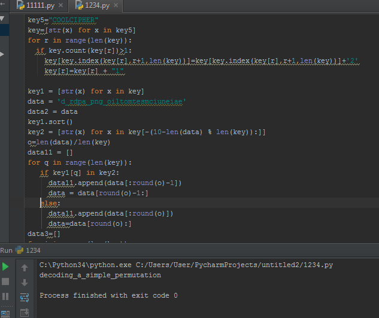

# UFO CTF School 2016 : Coolcipher

**Category:** ppc **Points:** 100
**Author:** richard 

**Description:**

> Исправьте ошибки.

## Write_up
<p>Для нахождения ошибок, запустим код в интерпретаторе Python3. Для удобства можно выбрать среду, в которой будет подсвечиваться синтаксис. К примеру Pycharm.</p>


Полностью исправленный код:

```python
    key5="COOLCIPHER"
    key=[str(x) for x in key5]
    for r in range(len(key)):
    if key.count(key[r])>1:
        key[key.index(key[r],r+1,len(key))]=key[key.index(key[r],r+1,len(key))]+'2'
        key[r]=key[r] + "1"

    key1 = [str(x) for x in key]
    data = 'FYDV_5VOT8K5_QL4ICNFG02TL3DMAP1BSN4FI8F'
    data2 = data
    key1.sort()
    key2 = [str(x) for x in key[-(10-len(data) % len(key)):]]
    o=len(data)/len(key)
    data11 = []
    for q in range(len(key)):
       if key1[q] in key2:
         data11.append(data[:round(o)-1])
         data = data[round(o)-1:]
     else:
         data11.append(data[:round(o)])
         data=data[round(o):]
    data3=[]
    for i in range(len(key)):
       data3.append("")
    for l in range(len(key1)):
        for k in range(len(key)):
           if key1[k] == key[l]:
              data3[l] = data11[k]
    qw=""
    count=0
    for c in range(round(o)):
       for v in range(len(data3)):
          qw+=data3[v][c]
          count+=1
          if count>round(o)*len(key1)-len(key2)-1:
             break
    print(qw)
```


## Flag

> **flag{decoding\_a\_simple_permutation}**
