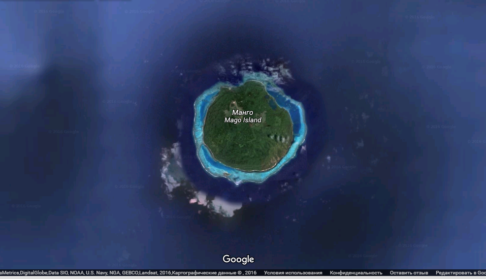

# UFO CTF School 2016 : island

**Category:** recon **Points:** 75
**Author:** richard 

**Description:**

> Как зовут хозяина острова? LTE3LjQ1MDIgLTE3OS4xNTc5 - это должно помочь

## Write_up

**LTE3LjQ1MDIgLTE3OS4xNTc5** - base.  
Декодируем, получаем -17.4502 -179.1579. Так как это должно помочь найти владельца, попробуем  использовать google maps.  
И да, это координаты острова. По названию острова, легко найти хозяина.

## Flag:

> **flag{Mel_Gibson}**
