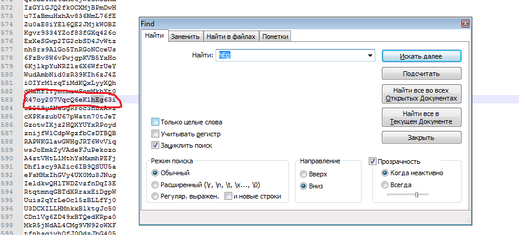

# UFO CTF School 2016 : 3part

**Category:** stegano **Points:** 200
**Author:** richard 

**Description:**

> Найдите все части флага. Каждая часть начинается с числа, и если соединить куски, то получите флаг. Соединяются куски в порядке возврастания чисел.(Пример: 1firstpart, 2secondpart. flag{1firstpart2secondpart})

## Write_up

### Получение 1 части флага
(copy /b 1.jpg + 2.zip 3.jpg) - погуглив, становиться понятно, что изображение содержит архив. Для получения архива достаточно поменять расширение на .rar. В архиве лежит файл, в нем числа. Декодируем (hex->str) несколько раз. Получаем 1 часть:

**1easy!!f!rstp@rt**

### 2 часть флага

Открываем архив, нужен пароль. Открываем data.txt с множеством строчек, readme.txt с подсказкой. Нажав Ctrl + f  находим пароль который содержит "hEg" (регистр важен). Открываем пароль, там текстовый файл. Используем сайт [raskladki.net](http://raskladki.net.ru/).

**2itshard!!secOnd_part**

### 3 часть флага

Используем скрипт(python), для нахождения строки с наибольшем количеством чисел.

     f=open("c:/data.txt","r")
     count=0
     for line in f:
       for s in line:
        if s.isdigit():
            count+=1
     if count>10:
        print(line)
     f.close()
33704072744f5f46406167 - декодируем из hex.

**3p@rtO_F@ag**

## Flag

> **flag{1easy!!f!rstp@rt2itshard!!secOnd\_part3p@rtO\_F@ag}**
