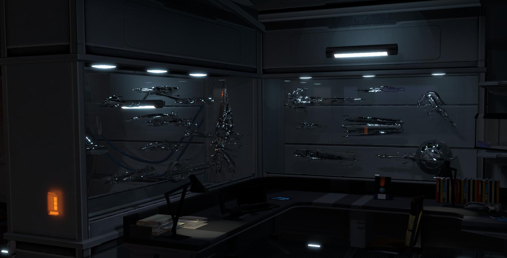

# UFO CTF School 2016 : Mazzn057aL9YEFfect

**Category:** stegano **Points:** 100
**Author:** innhunter 

**Description:**

> RU: Наш капитан в последнее время сам не свой. Мы знаем, что это очень плохо, но ты не мог бы проверить его каюту?
> ENG: Our captain in recent times is not himself. We know that this is very bad, but you could not check his cabin?

## Write_up

Скачиваем прикрепленный файл.

Видим каюту капитана. Подсказка говорит нам глядеть внутрь. Открываем картинку с помощью hex-редактора, например, 010 (http://www.sweetscape.com/010editor/).
В конце файла после битов конца png картинки IEND видим биты начала zip архива PK.
Вытягиваем архив. в нем находится картинка, но она не открывается.
При просмотре ее в 010, обнаруживаем,что в ней отсутствует хедер начала png 89 50 4E 47.
Дописываем хедер, получаем картинку с флагом.

## Flag

> **flag{SR1_on3_lov3}**
