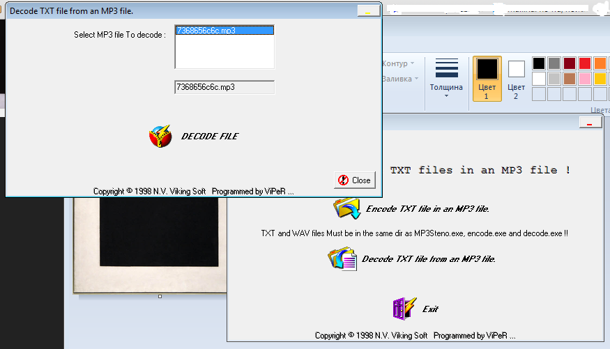

# UFO CTF School 2016 : hidden_data

**Category:** stegano **Points:** 100
**Author:** richard 

**Description:**

> Мы перехватили этот файл. Наши специалисты не справились.Вся надежда на вас.

## Write_up

[MP3Stego](http://www.petitcolas.net/steganography/mp3stego/) - программа позволяющая дешифровать (шифровать) данные, находящиеся в музыкальном файле.

В процессе дешифровки потребуется пароль ( хинт: пароль один из самых популярных). Немного погулить - получаем небольшой список паролей. Пароль - "password". В итоге дешифровки получаем текстовый файл с флагом.

## Flag

> ** flag{We\_need\_to_meet}**
