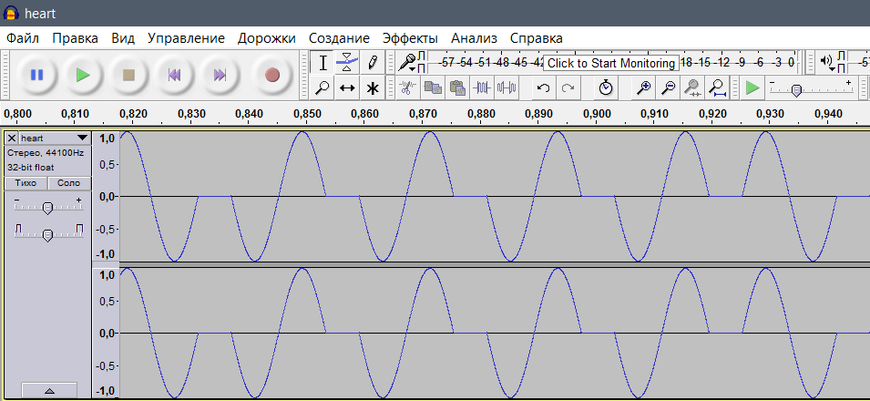

# UFO CTF School 2016 : listen to alien's heart

**Category:** stegano **Points:** 200
**Author:** innhunter 

**Description:**

> RU: Этот вид пришельцев общается с помощью сердечных вибраций. У нас есть фрагмент записи их речи, может ты сможешь расшифровать?  
> ENG: This type of aliens communicates via cardiac vibrations. We have a fragment of their speech, maybe you'll be able to decipher?

## Write_up

Скачиваем файл, открываем в редакторе Audacity.



Замечаем закономерность в звуковой волне - двоичный код. Ручками или с помощью скрипта парсим аудиодорожку. Получаем:
```
01010000001100110011000001110000010011000011001101011111001101000101001000110011010111110110111000110000001100000011100001110011010111110110100101101110010111110101001100110111001100110011100100110000
```
Используем сайт  http://www.roubaixinteractive.com/PlayGround/Binary_Conversion/Binary_To_Text.asp и получаем флаг.


## Flag

> **flag{P30pL3_4R3_n008s_in_S7390}**
