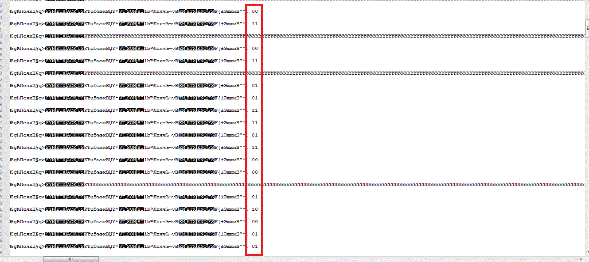

# UFO CTF School 2016 : manyparts

**Category:** stegano **Points:** 200
**Author:** richard 

**Description:**

> Задание похоже на 3part.Найдите все части флага. Каждая часть начинается с числа, и если соединить куски, то получите флаг. Какая-то часть шифрована. И не забудьте название таска (Пример: 1firstpart, 2secondpart. flag{1firstpart2secondpart})

## Write_up

### 1 часть
В файле many_m.txt находим первую часть путем удаления лишнего и заменой "m" на "".

**1part_hohh**

### 2 часть

Расшифровываем морзянку. Можно помощью [онлайн сервиса](http://morsecode.scphillips.com/labs/decoder/), можно с помощью [MRP40](http://www.polar-electric.com/Morse/MRP40-EN/MRP40-SDR.html) получаем "deunxcvljamicg2". Это [шифр Виженера](http://kmb.ufoctf.ru/crypto/vigener/main.html), пароль - "manyparts" (хинт!). "rehpicesromver2" - реверс строки- получаем часть флага

**2revmorsecipher**

### 3часть

Надеюсь, вы заметили помехи в морзянке: открываем с помощью notepad, находим `0011001101011111011100000110000101110010011101000011101100101001`, декодируем

**3_part;)**

### 4 часть

  
В 2_125.png есть [code128](https://zxing.org/w/decode)

  
[yadi.sk/d/HgimjkjOqTFMg](https://yadi.sk/d/HgimjkjOqTFMg). В gif мы видим семафорнскую азбуку. Получаем

**finalpart**

## Flag
> **flag{1part\_hohh2revmorsecipher3_part;)finalpart}**
