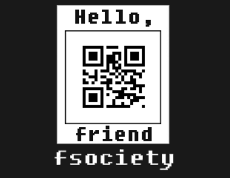

# UFO CTF School 2016 : mr{robot36}

**Category:** crypto **Points:** 150
**Author:** innhunter 

**Description:**

> RU: Нашими инженерами было обнаружено странное сообщение на сервере, посмотришь что там?
> ENG: Our engineers have found a strange message on the server. Look what is it?

## Write_up

Скачиваем прикрепленный файл.  
Гуглим название - robot36

https://en.wikipedia.org/wiki/Slow-scan_television
Slow-scan television (SSTV) is a picture transmission method used mainly by amateur radio operators, to transmit and receive static pictures via radio in monochrome or color. The Robot SSTV modes were designed by Robot corporation for their own SSTV unit.

Находим приложение для декодирования сообщения sstv robot 36.
https://play.google.com/store/apps/details?id=xdsopl.robot36&hl=ru

При дешифровке получается картинка с слабо видным qr-кодом.

Открываем прикрепленный файл в аудиоредакторе, например, Audacity, видим две дорожки. Распознавая каждую дорожку в отдельности в одной из них получаем четкое изображение qr-кода. Декодируем код получаем флаг.

  
  

## Flag

> **flag{Le4ve_ME_HERe}**
