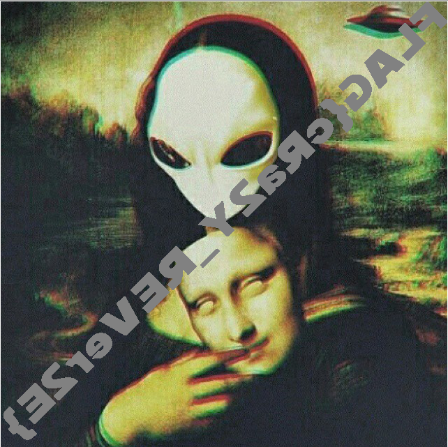

# UFO CTF School 2016 : reverse me, if you can

**Category:** stegano **Points:** 100
**Author:** innhunter 

**Description:**

> RU: Пришельцы оставили странное сообщение на нашем сервере, но мы так и не смогли понять что это, надеюсь ты справишься!
> ENG: Aliens left a strange message on our server, but we have not been able to understand it, I hope you can read it!

## Write_up

Название таска - один большой хинт.

Открываем прикрепленный файл любым hex-редактором, например, 010. Смотрим в конец и видим последовательность:
74 E4 05 98,
что является перевернутой подписью PNG-файла.

Пишем простой python-скрипт который реверснет файл:
```python
import binascii
in_image_name = 'in_image.png'
out_image_name = 'secret.png'

with open(in_image_name, 'rb') as in_file:
    content = in_file.read()
hex_to_reverse = binascii.hexlify(content)
reversed_hex = hex_to_reverse[::-1]

with open(out_image_name, 'wb') as out_file:
    out_file.write(binascii.unhexlify(reversed_hex))
```
На выходе получаем изображение содержащее флаг:


## Flag

> **flag{cRa2Y_REVer2E}**
