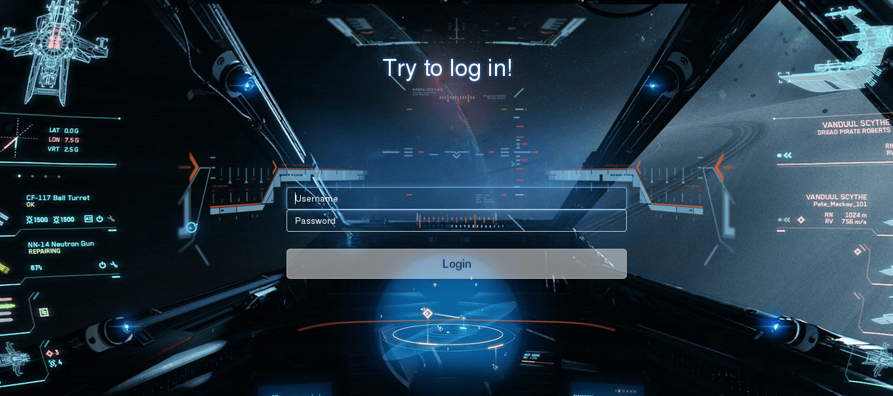
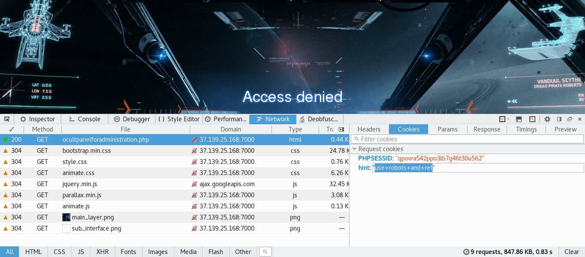
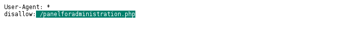
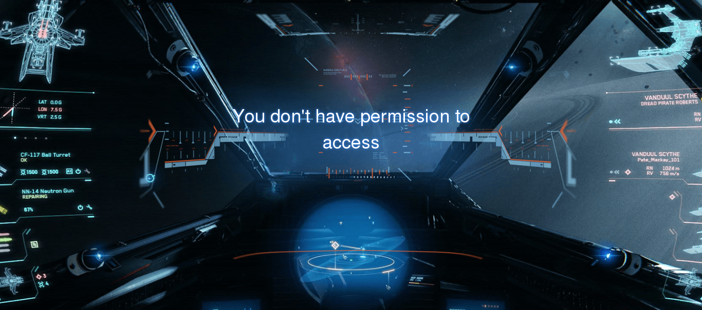
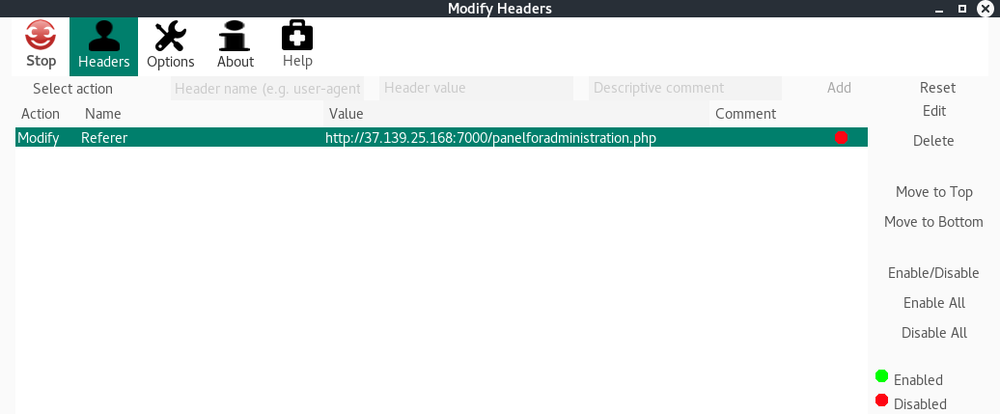
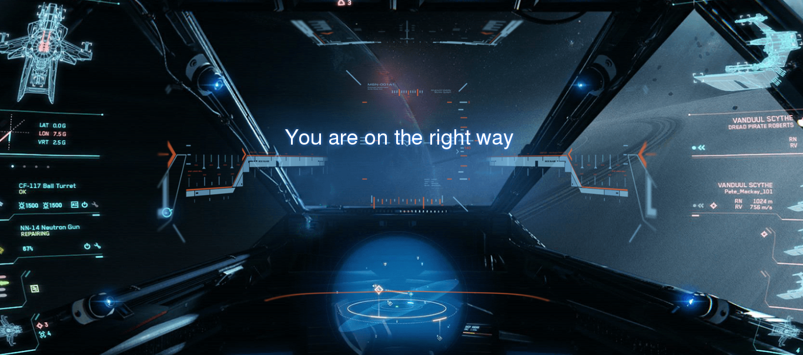
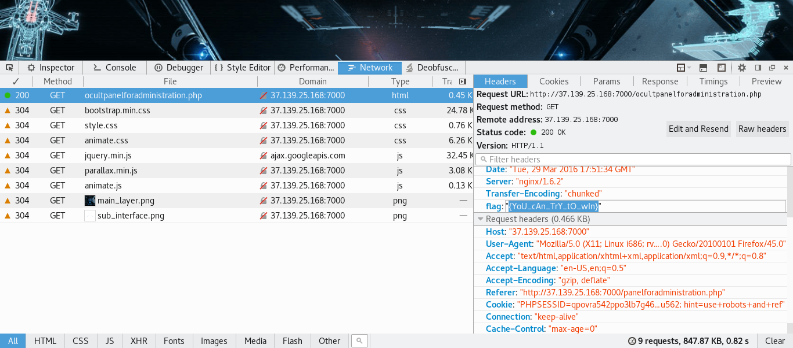

# UFO CTF School 2016 : Access denied

**Category:** web **Points:** 100
**Author:** chogori 

**Description:**

> *RU*: Мы вплотную подобрались к заговорщикам, единственное, что нам нужно - это доказательства. Мы нашли место где они хранят свои секреты, но они все-таки умеют скрываться. Помоги нам найти доказательства  
> *ENG*: We are getting to close to the conspirators , the only thing we need - is the proof . We found a place where they keep their secrets , but they still know how to hide. Help us find the evidence

## Write_up

Итак, открываем таск. Видим форму логина, наверное, стоит попробовать ввести в нее что-нибудь. Вводим что угодно и переходим на /ocultpanelforadministration.php Поковырявшись немного, находим такую штуку:

Становится понятно, что надо посмотреть что же в robots.txt:

Переходим по данную страницу и видим:

Вернувшись к хинту, понимаем, что надо было что-то засунуть в Referer, т.к. в хинте robots и referer были записаны вместе, думаю стоит их также и использовать, для этого можно воспользоваться, например, аддоном для мозиллы modify headers:

Далее переходим на /ocultpanelforadministration.php с данным Referer'ом и получаем:

Опять же исследовав страницу и хедеры находим флаг:

## Flag

> **flag{YoU_cAn_TrY_tO_wIn}**
