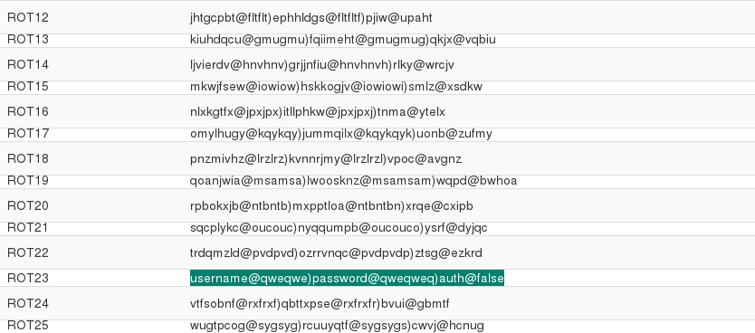

# UFO CTF School 2016 : Caesar is alive!

**Category:** web **Points:** 100
**Author:** chogori 

**Description:**

> *RU*: Случайно подслушал разговор двух членов нашего корабля, мне кажется, что с капитаном корабля скоро может случиться что-то плохое. Помогите узнать, что они задумали  
> *ENG*: Overheard a conversation between two members of our ship, it seems to me that the ship captain may soon happen something bad. Help to find out what they're up to

## Write_up

Открываем таск, видим форму логина:

Вводим любые данные для теста и получаем такой результат:

Следует обратить внимание на url, в token лежит интересная строка. Почитав описание и вспомнив название, можно сделать вывод о том, что это за строка и чем ее можно попробовать расшифровать. Находим онлайн декодер и пробуем:

Раз там false, логично что его надо поменять на true. Мы уже поняли что сдвиг на +3, поэтому пробуем "true" сдвинуть на +3:

Далее вводим в url наше закодированное "true":

и получаем флаг

## Flag

> **flag{cAeSAr_iS_hERe}**
