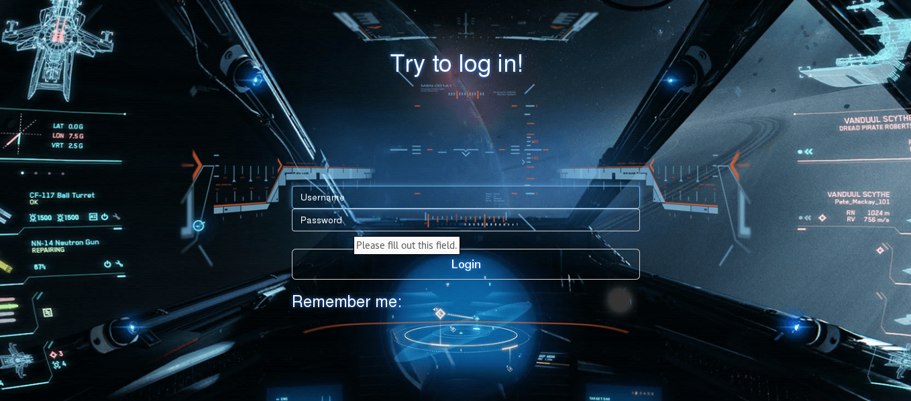
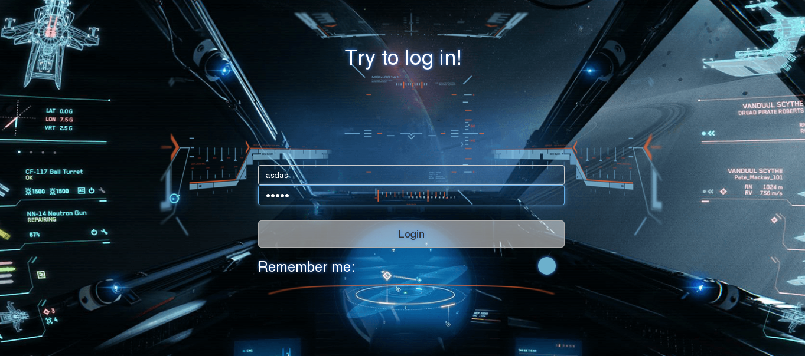
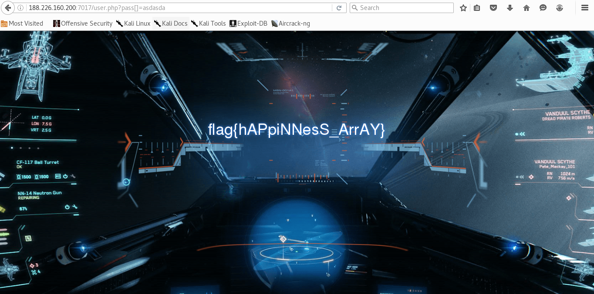

# UFO CTF School 2016 : Teardrop

**Category:** web **Points:** 250
**Author:** chogori 

**Description:**

> *RU*:Наш корабль приближается к массивной черной дыре. Пройдя через горизонт событий, мы не сможем спастись. Помоги нам  
> *ENG*:Our ship is approaching a massive black hole. After passing through the event horizon, we can not avoid. help us

## Write_up

Открываем таск, видим:

Обращаем внимание на кнопочку запомнить меня. Как только мы ее включаем в url появляется ?pass=то, что напишем в пароль. Думаю вся суть таска именно в этом. Тестим этот параметр всеми доступными нам способами. Через некоторое время вспоминается старая phpшная штука:

Из чего мы сразу становится понятся, что, чтобы решить таск, надо сделать воооот такую магию(добавить []):

и сразу получаем флаг

## Flag

> **flag{hAPpiNNesS_ArrAY}**
