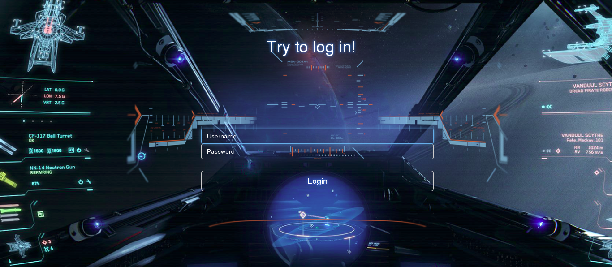
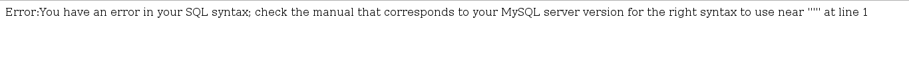
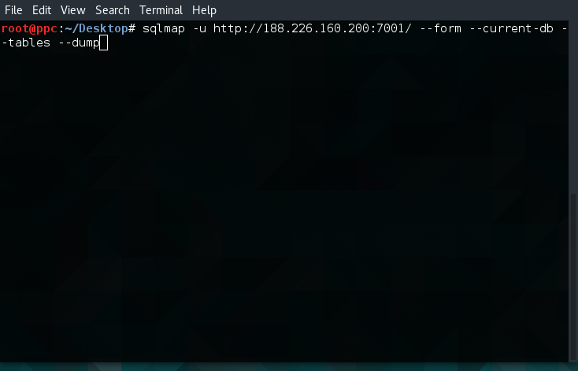
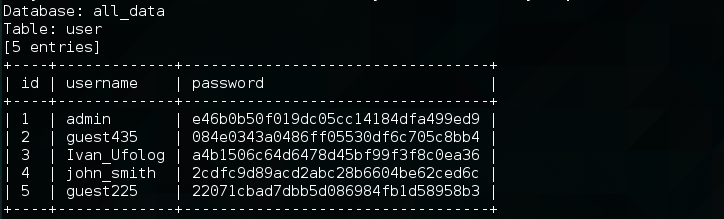

# UFO CTF School 2016 : all_data

**Category:** web **Points:** 200
**Author:** chogori 
**Description:**

> *RU*: Кто-то атаковал наш бортовой компьютер, и мы не имеем доступа к нашим данным. Пожалуйста, найди способ получить данные и выбери из них пароль одного из пользователей, которого ты должен знать. Формат флага: flag{data}.  
> *ENG*: Somebody attacked our on-board computer , and we do not have access to our data . Please find a way to get data to and touch the password of a user , which you should know. Format flag: flag{data}

## Write_up

Открываем таск и видим форму логина:

Варьируя различные вводимые данные, получаем интересный результат:

Значит в данном таске используется база данных и, немного подумав над описанием к заданию, можно понять, что надо вытащить данные из базы. Сделать это можно составляя запросы руками в форме логина или используя sqlmap. Изучив документацию к sqlmap, мы знаем какие именно ключи нам нужно использовать:

Менее чем через минуту мы получаем наш результат:

К моменту решения этого таска, большинство участников уже знали кто такой Иван Уфолог, поэтому можно было догадаться, что надо воспользовать хешем именно этого пользователя.

## Flag

> **flag{a4b1506c64d6478d45bf99f3f8c0ea36}**
