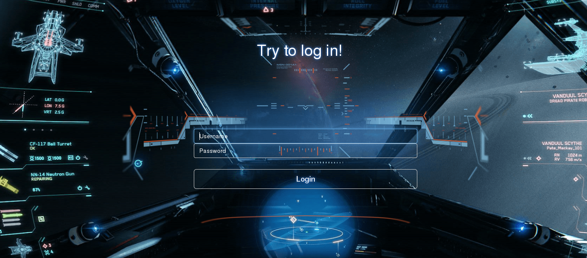
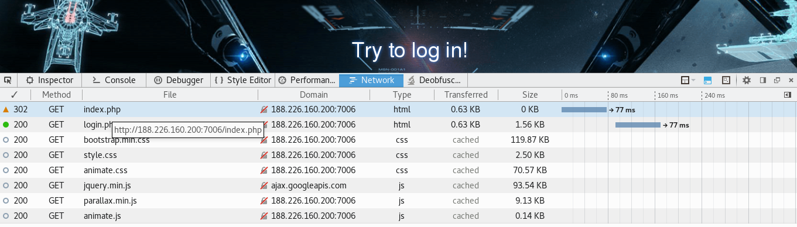
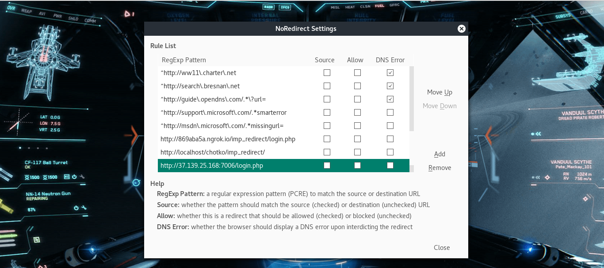
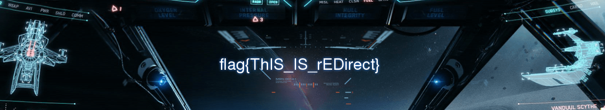

# UFO CTF School 2016 : go away

**Category:** web **Points:** 150
**Author:** chogori 

**Description:**

> *RU*: И снова я встретил заговорщиков, они стояли у терминала и что-то долго пытались там сделать, я попросил одного из своих друзей пройти мимо и попытаться подсмотреть что же там. Вернувшись, друг сказал, что единственное, что он смог увидеть было название файла - index.php. Когда они ушли я подошел к терминалу и попытался открыть этот файл, но у меня не получилось. Помогите мне открыть файл index.php  
> *ENG*: Again I met the conspirators, they were at the terminal, and that a long time trying to do there, I asked one of my friends pass by and try to spy on what is there. When he returned, the friend said that the only thing he could see was the file name - index.php. When they left, I went to the terminal and tried to open the file, but I did not succeed. Help me open the index.php file

## Write_up

Открываем таск, видим:

Пробуем открыть index.php, но у нас ничего не получается, смотрим в network:

Видим, что код ответа сервера 302 Moved Temporarily. Значит надо как-то обойти редирект, для этого можно воспользоваться аддоном для мозиллы NoRedirect:

Вставив нужные нам данные и сохранив, перезагружаем страницу и получаем:

## Flag

> **flag{ThIS_IS_rEDirect}**
