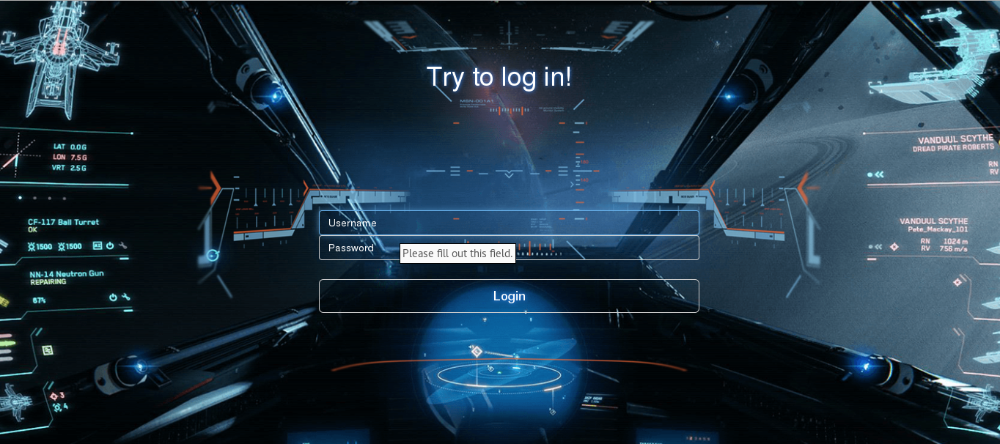
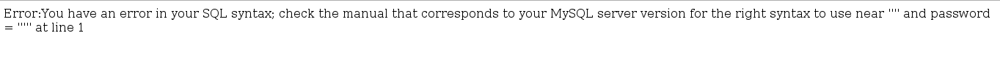
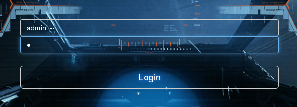
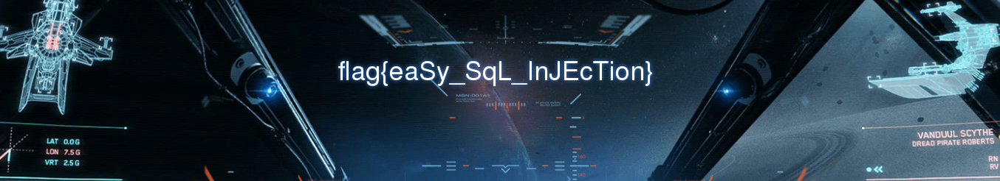

# UFO CTF School 2016 : log_for_admin

**Category:** web **Points:** 150
**Author:** chogori 

**Description:**

> *RU*: Все еще пытаемся устранить последствия после нашего глупого администратора. Помогите нам залогиниться, пожалуйста  
> *ENG*: Still we are trying to eliminate the consequences of following our foolish administrator. Help us login, please

## Write_up

Открываем таск, видим:

Немного поизучав форму логина, вводя различные значения получили:

Значит таск с базой данных и ковычки не экранируются - можно попробовать провести sql injection, зная, что залогиниться надо под админом, пытаемся составить инъекцию(в пароле просто одинарная ковычка, хотя там неважно что ставить, потому что после "--" все считается комментарием):

Введя эти данные получаем:

## Flag

> **flag{eaSy_SqL_InJEcTion}**
