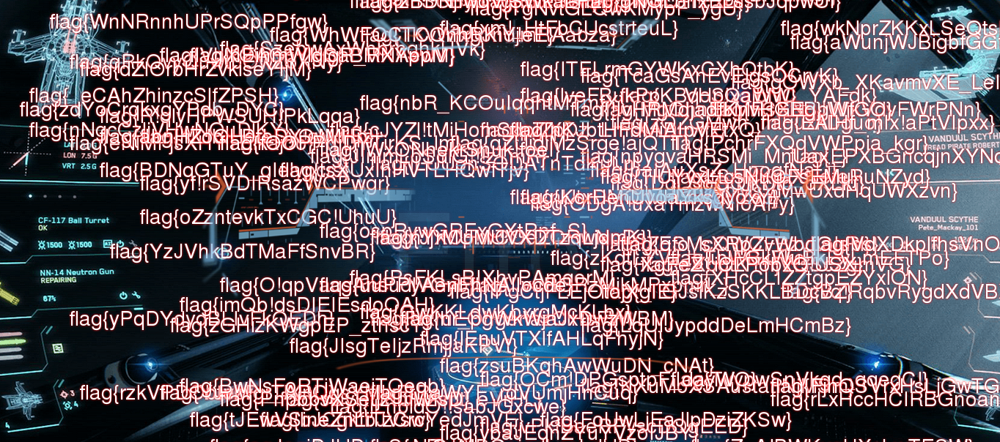
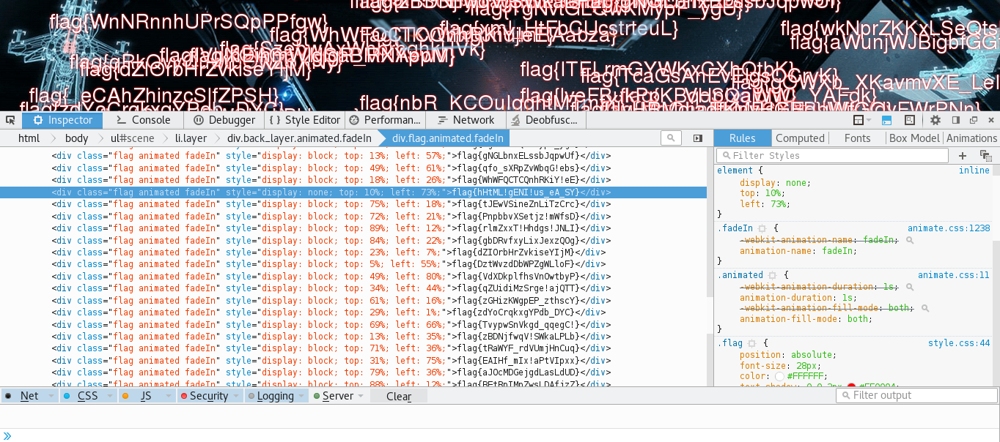

# UFO CTF School 2016 : look closely

**Category:** web **Points:** 100
**Author:** chogori 

**Description:**

> *RU*: Заговорщики почти добились своего. Наш корабль в аварийном состоянии, мы не можем понять, что происходит с нашим бортовым компьютером, если ты нам не поможешь, то мы все разобьемся  
> *ENG*: The conspirators almost succeeded. Our ship is in bad condition , we can not understand what is happening with our on-board computer , if you do not help us , then we 'll crash

## Write_up

Открываем таск, видим:

Открываем сорсы, видим кучу флагов, но один слегка привлекает внимание тем, что он отличается от остальных, думаю он и является флагом, не зря же он не отображается.

## Flag

> **flag{hHtML!gENI!us_eA_SY}**
