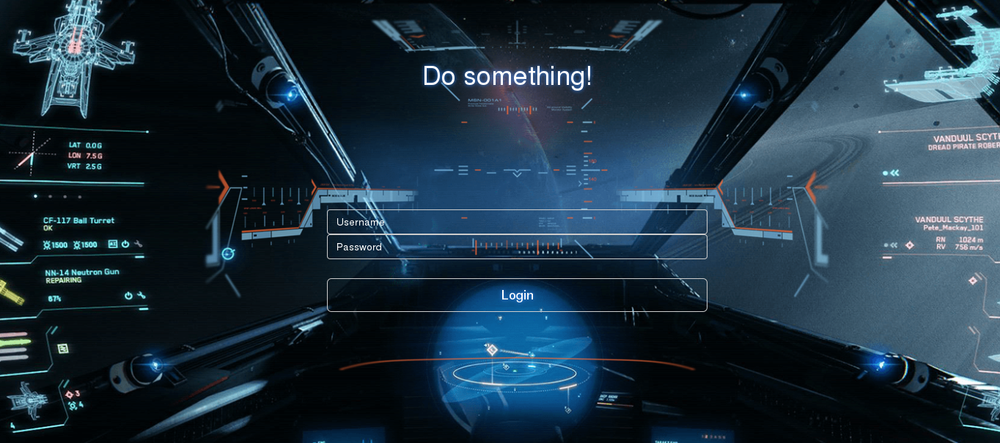
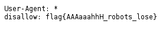

# UFO CTF School 2016 : mechanical attack

**Category:** web **Points:** 50
**Author:** chogori 

**Description:**

> *RU*: Что-то странное происходит на нашем корабле. Бортовой компьютер работает нестабильно, освещение на корабле тоже, в стенах слышен какой-то странный звук, больше похожий на лязг. В общем, на корабле аварийная ситуация, пожалуйста, помоги нам спасти корабль  
> *ENG*: Something strange is happening to our ship. On-board computer becomes unstable, the lighting on the ship, too, the walls heard a strange sound, more like a clang. In general, the ship an emergency, please, help us to save the ship

## Write_up

Открываем таск, видим:

В описании слишком много намеков на роботов, думаю, надо взглянуть на robots.txt:

## Flag

> **flag{AAAaaahhH_robots_lose}**
