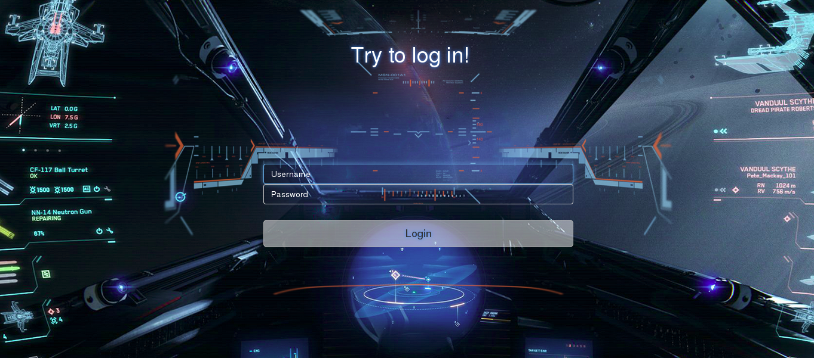
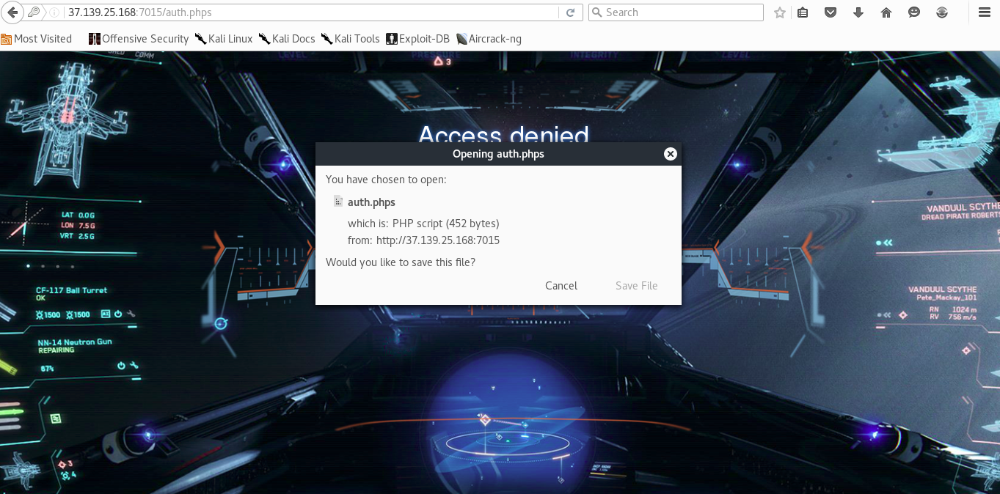
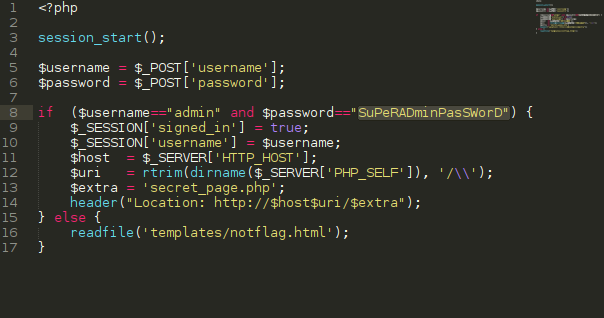
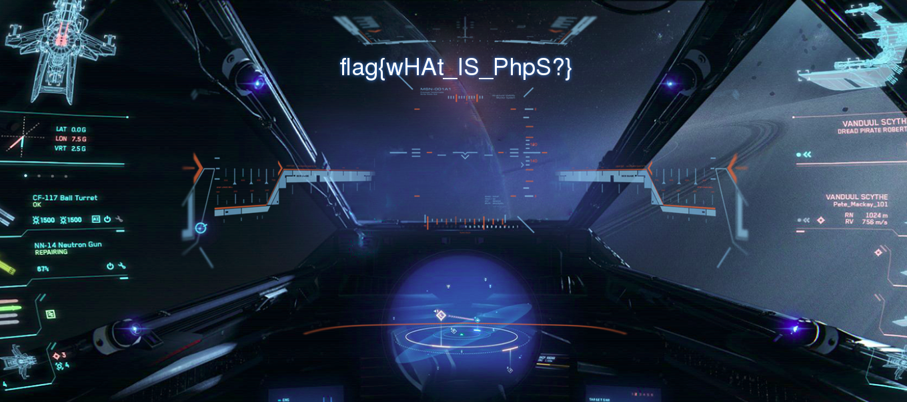

# UFO CTF School 2016 : treasures

**Category:** web **Points:** 150
**Author:** chogori 

**Description:**

> *RU*:Заговорщики снова в деле! они сделали что-то непонятное с одним из корабельных терминалов - на экране огромная надпись, в которой сказано, что они хотят сокровищ и анимация падающих монеток. Помогите нам разобраться с этим  
> *ENG*:The conspirators back in business ! they did that - something strange with one of the ship terminals - on a huge screen legend , which says that they want to treasure and animation of falling coins . Help us to deal with this

## Write_up

Открываем таск, видим:

Пробуем вводить различные данные, но это приводит только к "Access denied". Долго мучаясь пробуя в url получить бэкапы, можно случайно найти магическую штуку php sources, для этого нужно в url написать "auth.phps" и данный файл успешно скачается с сервера

Открываем:

Вводим логин и пароль:

## Flag

> **flag{wHAt_IS_PhpS?}**
