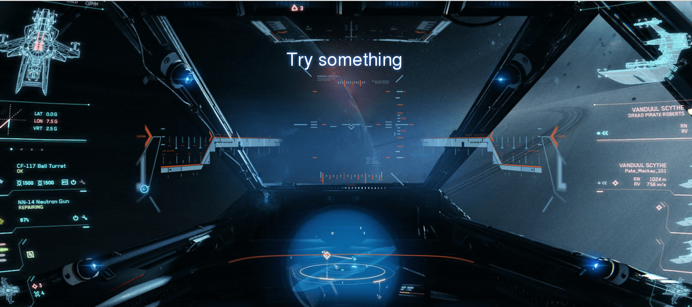
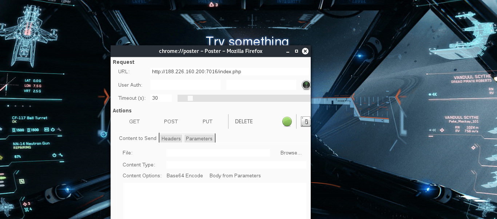
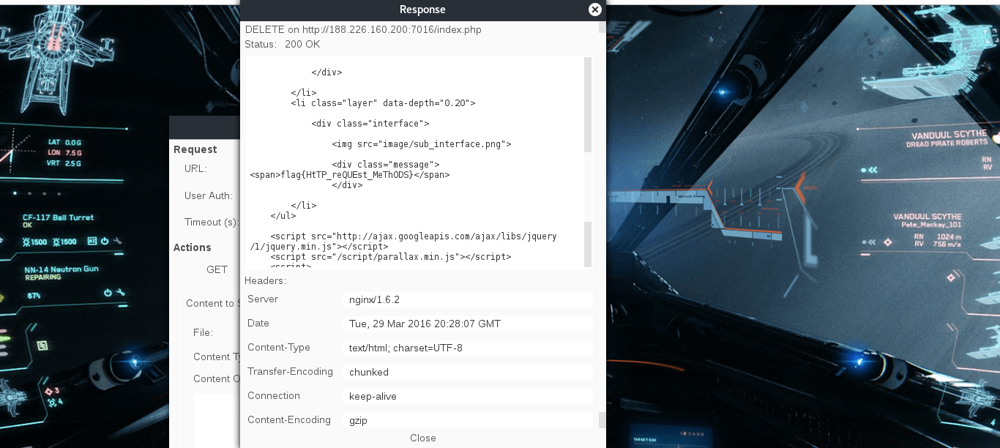

# UFO CTF School 2016 : use head, but not only yours

**Category:** web **Points:** 100
**Author:** chogori 

**Description:**

> *RU*:Увидев тех двух заговорщиков, я решил за ними проследить. Я шел за ними до тех пор, пока меня кто-то не ударил по голове. Последнее, что я смог услышать из их разговора что-то про методы,запросы или методы запросов. В общем, плохо помню из-за удара. Помогите мне справиться с этим  
> *ENG*:Seeing those two conspirators, I decided to follow them. I followed them up until I have someone hit on the head. The last thing I was able to hear from their conversation something about the methods, queries or query methods. In general, I do not remember because of the strike. Help me deal with this

## Write_up

Открываем таск, видим:

Внимательно прочитав описание и вникнув в название таска, можно сделать вывод о том, что здесь замешаны http request methods. пробуем посылать различные запросы с помощью аддона для мозиллы Poster и на delete мы получаем флаг

Важно обращаться именно к "index.php", а не к "/"

## Flag

> **flag{HtTP_reQUEst_MeThODS}**
